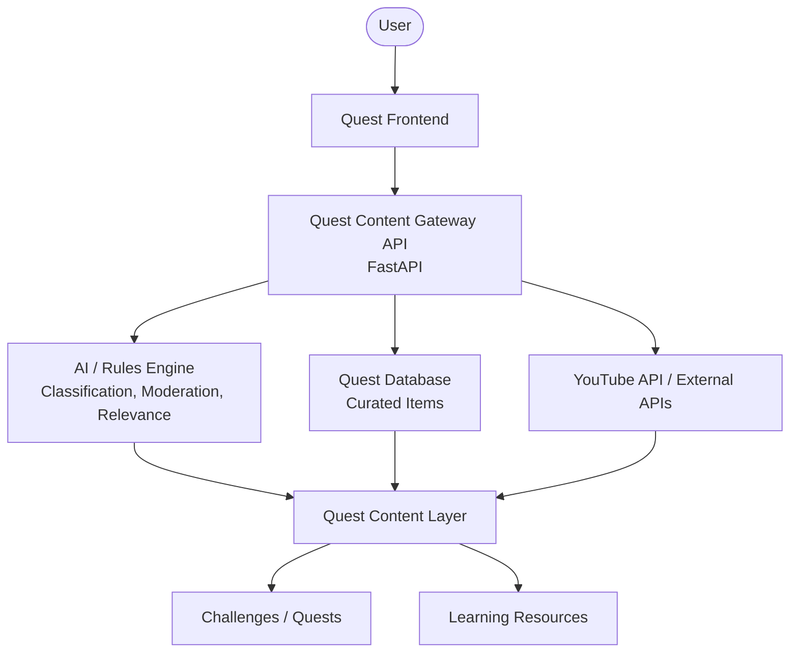

# 12. Quest Resource Engine (Architecture & Vision)
_Last Modified: 2026-09-21_

## Overview

The **Quest Resource Engine** is a first-class backend capability designed to act as a curated participation and learning layer over existing platforms (starting with YouTube). It ensures that Quest does not merely become a video-hosting platform or an attention-maximizing feed, but rather a tool to help users turn information into participation. 

The core philosophy is: **Learn → Try → Participate → Complete → Reflect → Grow.**

## Architectural Diagram



## The "Resource Engine" Concept

The backend operates as an intent-driven **Query Engine** rather than a simple proxy. 
Instead of sending raw user queries to external platforms, it follows this pipeline:
1. **User Intent:** The user asks for a resource or opens a Quest.
2. **Intent Interpretation:** The engine interprets what the user actually needs.
3. **Search Strategy:** It builds optimal queries (e.g., "confident self introduction" instead of just "introduction").
4. **External Search & AI Filtering:** It queries YouTube/others, runs the results through policy and relevance engines.
5. **Curation:** It saves metadata and references (not the actual video file) to the Quest Database.
6. **Presentation:** The frontend displays it as an "External Resource" clearly contextualized within a Quest.

### Data Model Concept
```json
{
  "title": "...",
  "source": "YouTube",
  "video_id": "...",
  "channel": "...",
  "thumbnail": "...",
  "duration": "...",
  "url": "...",
  "topic": "social-confidence",
  "quest_relevance": 0.92
}
```

## Content Policy Engine

The engine is governed by four primary policies to ensure safety and quality:
1. **Source Policy:** Allowed/blocked platforms, domains, age/geo restrictions.
2. **Topic Policy:** Allowed/prohibited categories, educational and Quest relevance.
3. **Quality Policy:** Channel reputation, duration, duplicate content, misleading title detection.
4. **Quest Relevance Score:** `Topic relevance + Learning usefulness + Quest relevance + Quality + Safety`.

## Tiered Curation Model

To allow evolution without massive architectural overhead, the platform scales through three tiers:
1. **Level 1 (Curated):** Human administrators explicitly approve resources before they hit the app.
2. **Level 2 (Assisted):** AI finds candidates; humans approve them via the Admin Console.
3. **Level 3 (Dynamic):** User searches pass through the Policy Engine, AI classification, and Ranking to serve results instantly.

## The Frontend Experience

The Learn section is distinctly separate from the main Experience Feed (which focuses on active participation and events).

**Mission Control Hierarchy:**
```text
Mission Control
│
├── Today's Quest
├── Upcoming Events
├── Communities
├── Growth
│
└── Learn
      ├── Recommended for this Quest
      ├── Tutorials
      ├── How-To
      └── Explore
```
By keeping educational resources anchored to a "Learn" tab and specific Quests, the platform avoids the "infinite watch" loop and drives users toward physical world action and challenge completion.

## Proposed FastAPI Service Structure

A lightweight Content Intelligence / Resource Gateway service.

```text
FastAPI
│
├── /search
├── /resources
├── /resources/{id}
├── /quests/{id}/resources
├── /recommendations
├── /admin/resources
├── /admin/rules
└── /admin/queries
```

### Database Tables Needed:
- `resources`
- `resource_sources`
- `resource_topics`
- `quest_resources`
- `search_queries`
- `query_rules`
- `content_reviews`
- `blocked_sources`
- `content_reports`
